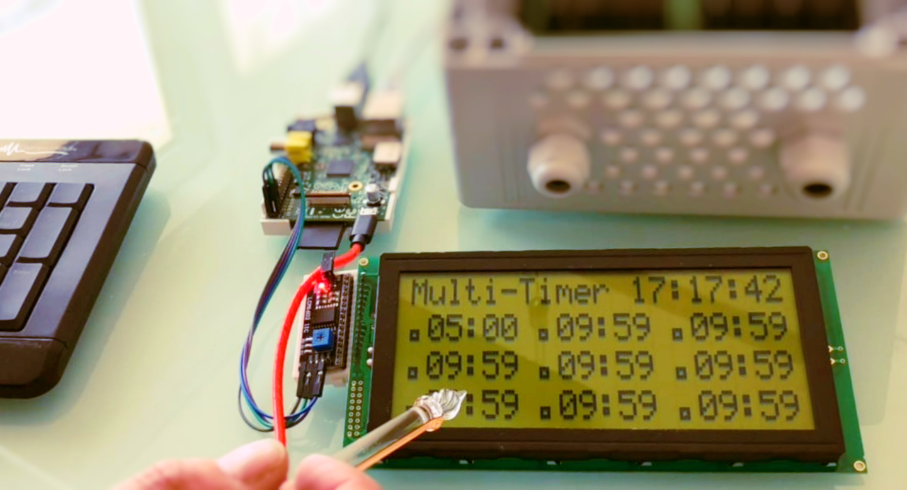
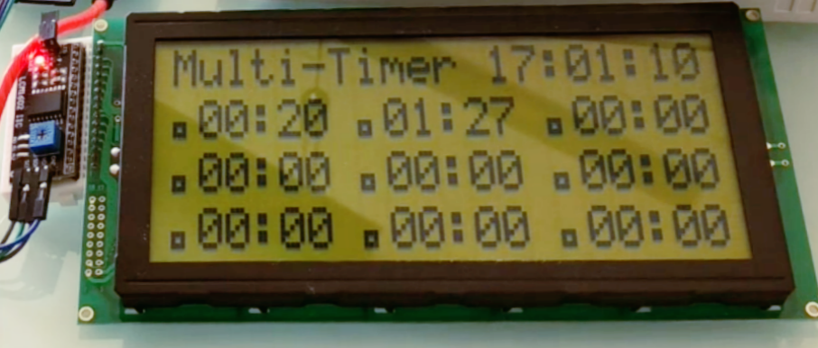

# MultiTimer
Raspberry Pi: Mehrfach-Timer mit LCD und USB-Keypad, Python

  

Zunächst die SD-Karte mit dem Raspbian / Raspberry Pi OS beschreiben und die Grundkonfigurationen vornehmen.

Zusätzlich noch die Module für Python installieren:

<code>
sudo apt-get install python3-smbus i2c-tools python3-pip
</code>

Damit die Ansteuerung des LCD via I2C möglich wird, muss dieses noch freigeschaltet werden:

<code>
raspi-config 
</code>

Hierin dann I2C freischalten.

Dann noch in /etc/modules die I2C-Kernelmodule laden:

<code>
sudo vi /etc/modules   <- i2c-bcm2708  i2c-dev eintragen
</code>

Und dann den RPI neustarten

<code>
sudo init 6
</code>

Nach dem Anschluß des I2C-Interfaces kann dies nun getestet werden:

<code>
sudo i2cdetect -y 1
</code>

Hierbei wird dann die Adresse 0x20 als AKTIV gekennzeichnet

Weitergehende LCD-Tests:

# nun die lib für das LCD installieren:

<code>
sudo pip3 install RPLCD
</code>

# nun Testscript ausführen:

<code>
rplcd-tests i2c testsuite expander=PCF8574 addr=0x20 port=1 cols=20 rows=4
</code>

-----------------------------------------------

  

Nachdem diese Test alle durchlaufen wurden, kann das eigentliche Script ausgeführt werden. Diese enthält noch keine Hardware-Ausgabe, diese kann somit spezifisch auf die Erfordernisse ergänzt und angepasst werden. 